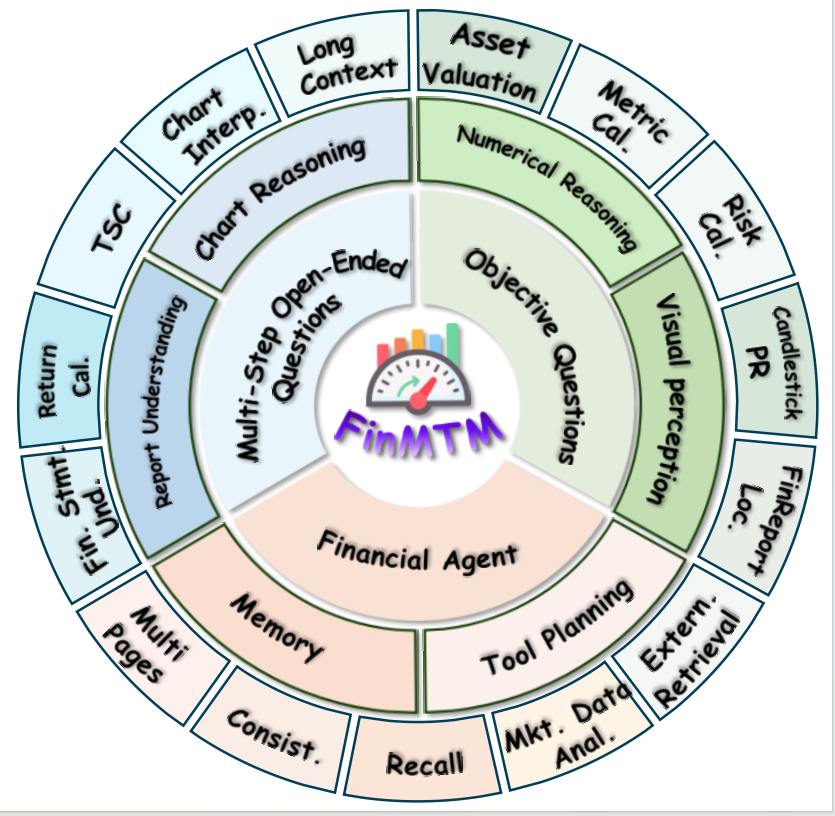
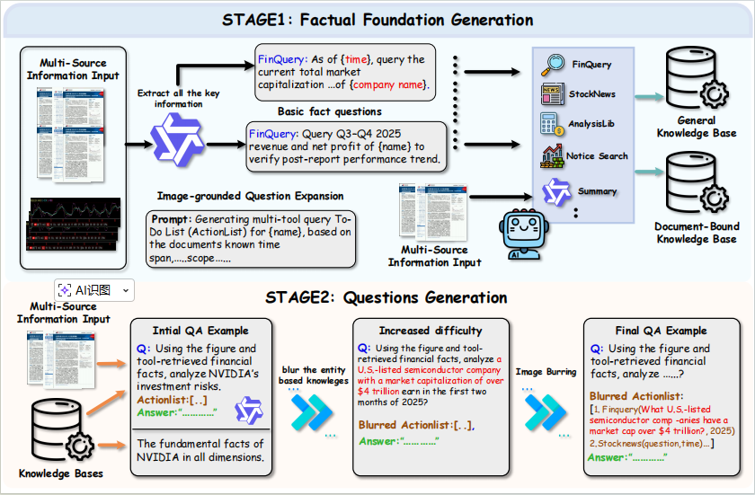

# FinMTM: A Multi-Turn Multimodal Benchmark for Financial Reasoning and Agent Evaluation

<p align="center">
  <a href="PAPER_URL"></a>
  <a href="ARXIV_URL"></a>
  <a href="HF_DATASET_URL"></a>
  <a href="LEADERBOARD_URL"></a>
  <a href="LICENSE_URL"></a>
</p>

<p align="center">
  <b>FinMTM</b> is a multi-turn multimodal benchmark that evaluates financial VLMs under three settings:
  objective questions, open-ended dialogues, and agent-based tasks with tool-use and multi-source evidence.
</p>
<p align="center">
  
</p>
<p align="center"><i>Overview of FinMTM: task types and capability coverage.</i></p>

---

## 🔥 Updates
- **2026-01**: Initial release of benchmark paper and evaluation protocol.
- **TBD**: Dataset & evaluation scripts release.
- **TBD**: Online leaderboard opens for submissions.

---

## 📌 Contents
- [Overview](#-overview)
- [Results](#-results)
- [Evaluation](#-evaluation)
- [Leaderboard Submission](#-leaderboard-submission)
- [Dataset Access](#-dataset-access)
- [Quickstart](#-quickstart)
- [Citation](#-citation)
- [License](#-license)
- [Contact](#-contact)

---

## 🧭 Overview
Financial reasoning is challenging for VLMs due to specialized chart formats, dense domain knowledge, long-horizon dependencies, and evidence-grounded tool use. Existing benchmarks are mostly single-turn and do not sufficiently measure **multi-turn dialogue stability**, **session-level memory**, or **agentic planning and execution**.

**FinMTM** addresses this gap by providing:
- **Objective questions**: single-/multiple-choice tasks grounded in financial visuals.

- **Open-ended questions**: multi-turn conversations that stress compositional reasoning, multi-step calculation, self-correction, and memory.

- **Financial agent task**: tool-augmented multi-source workflows with long-horizon planning and evidence-grounded answers.

  

**Capability Axes (examples)**

- Chart/figure understanding, numerical reasoning, entity binding, cross-turn consistency, memory recall.
- Tool planning, tool invocation correctness, evidence-grounded summarization.

---



**Fig. X.** Our multi-stage construction pipeline. We progressively build (i) objective visual-grounded items, (ii) multi-turn open-ended sessions emphasizing composition/calculation/self-correction/memory, and (iii) agentic workflows with tool planning, tool execution, and evidence-grounded responses.

## 📊 Results
We benchmark a range of leading VLMs on FinMTM. The final score is the average across:
**Objective Questions**, **Open-Ended Questions**, and **Financial Agent**.

<p align="center">
  
</p>
<p align="center"><i>Comparison of leading VLMs on FinMTM. Final score is the average of Objective, Open-Ended, and Agent tasks.</i></p>

**Key observations**

- Agentic settings expose larger gaps than pure reasoning-only settings.
- Entity de-identification / fuzzing increases uncertainty and stresses evidence-grounded reasoning.
- Scaling helps, but robust tool planning and execution remain a major bottleneck for open-source models.

---


## 📏 Evaluation
FinMTM uses task-aware evaluation protocols across the three settings.

### 1) Objective Questions
- Exact-match scoring over the predicted option(s).
- Multi-choice uses a set-overlap rule (precision/recall/F-score style) to penalize missing or spurious selections.

### 2) Open-Ended Dialogues (Multi-turn)
We score dialogues with a **weighted combination** of:
- **turn-level quality** (per-turn correctness, grounding, reasoning quality)
- **session-level quality** (cross-turn consistency, long-context stability, memory correctness)

> Notably, the level taxonomy is defined at the **session level**, i.e., each level characterizes the overall cognitive requirement of an entire multi-turn conversation rather than any single turn in isolation.

### 3) Financial Agent Tasks
We evaluate:
- **planning quality** (step ordering, tool selection, decomposition)
- **tool execution** (tool name + core args correctness; evidence sufficiency)
- **final outcome** (answer correctness + evidence-grounded summarization)

---


## 🏁 Leaderboard Submission
We welcome submissions to the online leaderboard.

**Submission includes**
- model name & version
- inference configuration (decoding, temperature, max tokens, etc.)
- outputs in the required JSON format
- optional system prompt / reasoning prompt (if permitted)

👉 See: `LEADERBOARD_URL` (coming soon)

---

## 📦 Dataset Access
- **HuggingFace**: `HF_DATASET_URL`
- **License / Terms**: check dataset card and paper appendix.
- If some data sources have redistribution constraints, we provide:
  - processed metadata and evaluation splits
  - script-based re-creation instructions where applicable

---

## ⚡ Quickstart

### Installation
```bash
git clone PROJECT_URL
cd finmtm
python -m venv .venv
source .venv/bin/activate
pip install -r requirements.txt
