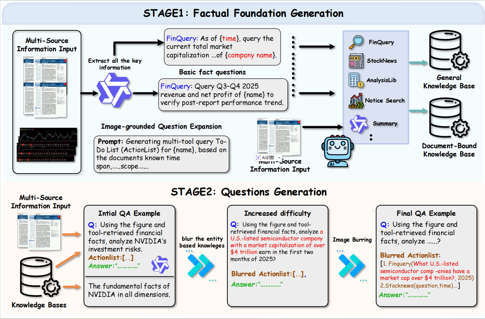
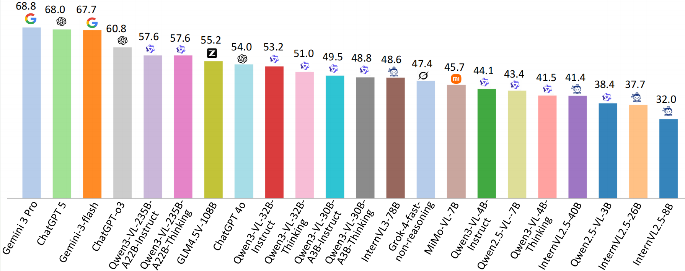

<p align="center">
  <h1 align="center">
    
    FinMTM: A Multi-Turn Multimodal Benchmark for Financial Reasoning and Agent Evaluation
  </h1>
</p>
  <p align="center">
       <strong>Chenxi Zhang</strong>
    ,
    <strong>Ziliang Gan</strong>
    ,
    <strong>Liyun Zhu</strong>
    ,
    <strong>Qing Zhang</strong>
    ,
     <strong>Rongjunchen Zhang</strong><sup>♠</sup>,
  </p>

<p align="center">
  📖<a href="https://bbdjj.github.io/FinMTM.github-io/">Paper</a> | 🏠<a href="https://bbdjj.github.io/FinMTM.github-io/">Homepage</a>|🤗<a href="https://huggingface.co/datasets/HiThink-Research/FinMTM">Huggingface</a>
</p>

<!-- <p align="center">
  <a href="https://bbdjj.github.io/FinMTM.github-io/"></a>
  <a href="ARXIV_URL"></a>
  <a href="HF_DATASET_URL"></a>
  <a href="LEADERBOARD_URL"></a>
  <a href="LICENSE_URL"></a>
</p> -->

<!-- <p align="center">
  <b>FinMTM</b> is a multi-turn multimodal benchmark that evaluates financial VLMs under three settings:
  objective questions, open-ended dialogues, and agent-based tasks with tool-use and multi-source evidence.
</p> -->
<br>
<p align="center">
  
</p>
<p align="center"><i>Overview of FinMTM: task types and capability coverage.</i></p>

---

## 🔥 Updates
- **2026-01**: Initial release of benchmark paper and evaluation protocol.
- **TBD**: Dataset & evaluation scripts release.
- **TBD**: Online leaderboard opens for submissions.

---

## 📌 Contents
- [Overview](#-overview)
- [Results](#-results)
- [Evaluation](#-evaluation)
- [Leaderboard Submission](#-leaderboard-submission)
- [Dataset Access](#-dataset-access)
- [Quickstart](#-quickstart)
- [Citation](#-citation)
- [License](#-license)
- [Contact](#-contact)

---

## 🧭 Overview
Financial reasoning is challenging for VLMs due to specialized chart formats, dense domain knowledge, long-horizon dependencies, and evidence-grounded tool use. Existing benchmarks are mostly single-turn and do not sufficiently measure **multi-turn dialogue stability**, **session-level memory**, or **agentic planning and execution**.

**FinMTM** addresses this gap by providing:
- **Objective questions**: single-/multiple-choice tasks grounded in financial visuals.

- **Open-ended questions**: multi-turn conversations that stress compositional reasoning, multi-step calculation, self-correction, and memory.

- **Financial agent task**: tool-augmented multi-source workflows with long-horizon planning and evidence-grounded answers.

  

**Capability Axes (examples)**

- Chart/figure understanding, numerical reasoning, entity binding, cross-turn consistency, memory recall.
- Tool planning, tool invocation correctness, evidence-grounded summarization.

---
**Multi-stage data construction** 

Beyond task design, we propose a novel multi-stage data construction pipeline to systematically scale multi-turn financial sessions—from visual-grounded primitives, to compositional multi-step dialogues, and further to tool-augmented agentic workflows—ensuring that each session is intentionally aligned with targeted cognitive requirements and remains traceable to verifiable evidence.



Our multi-stage construction pipeline. We progressively build (i) objective visual-grounded items, (ii) multi-turn open-ended sessions emphasizing composition/calculation/self-correction/memory, and (iii) agentic workflows with tool planning, tool execution, and evidence-grounded responses.

## 📊 Results
We benchmark a range of leading VLMs on FinMTM. The final score is the average across:
**Objective Questions**, **Open-Ended Questions**, and **Financial Agent**.

<p align="center">
  
</p>
<p align="center"><i>Comparison of leading VLMs on FinMTM. Final score is the average of Objective, Open-Ended, and Agent tasks.</i></p>


### Benchmark Results

**Columns**
- **Objective Questions**: Single, Multi  
- **Open-Ended Ques.**: Com., Cal., SelfCorr., Mem.  
- **Financial Agent**: w fuzz, w/o fuzz  

| Method | Obj-Single | Obj-Multi | Open-Com. | Open-Cal. | Open-SelfCorr. | Open-Mem. | Agent-w fuzz | Agent-w/o fuzz |
|---|---:|---:|---:|---:|---:|---:|---:|---:|
| _Proprietary Models_ |||||||||
| ChatGPT-4o | 79.3 | 49.1 | 77.2 | 76.8 | 46.2 | 38.9 | 29.7 | 34.8 |
| ChatGPT-o3* | 85.8 | 73.3 | 83.8 | 78.6 | 52.8 | 43.6 | 31.4 | 35.2 |
| ChatGPT-5* | 89.0 | **79.6** | <u>86.9</u> | <u>80.7</u> | <u>56.9</u> | <u>46.7</u> | 35.9 | 49.7 |
| Gemini 3 Flash | <u>91.9</u> | 78.1 | 82.2 | 76.0 | 55.4 | 41.6 | **53.6** | **62.6** |
| Grok-4-fast-non-reasoning* | 71.0 | 46.8 | 66.0 | 61.2 | 39.9 | 24.8 | 30.2 | 39.7 |
| Gemini 3 Pro | **92.1** | <u>78.4</u> | **87.5** | **82.8** | **58.8** | **48.5** | <u>48.3</u> | <u>54.3</u> |
| _InternVL Series_ |||||||||
| InternVL2.5-8B | 63.8 | 25.7 | 55.1 | 49.2 | 26.5 | 16.7 | 8.4 | 10.5 |
| InternVL2.5-26B | 70.5 | 31.3 | 61.7 | 57.7 | 32.3 | 22.8 | 11.2 | 14.0 |
| InternVL2.5-40B | 72.3 | 35.2 | 66.1 | 64.6 | 36.2 | 26.7 | 13.5 | 16.8 |
| InternVL3-78B | 75.6 | 42.4 | 76.2 | 77.6 | 43.6 | 32.6 | 18.2 | 22.8 |
| _Other VL Series_ |||||||||
| MiMo-VL-7B | 61.1 | 21.4 | 75.1 | 75.4 | 47.2 | 39.9 | 20.2 | 25.5 |
| GLM4.5V-108B | 73.7 | 51.0 | 85.4 | 79.6 | 51.1 | 42.2 | 26.5 | 32.4 |
| _Qwen VL Series_ |||||||||
| Qwen2.5-VL-3B | 64.5 | 16.4 | 68.2 | 67.7 | 40.5 | 27.6 | 9.4 | 11.9 |
| Qwen2.5-VL-7B | 73.4 | 24.1 | 74.3 | 73.4 | 43.1 | 33.9 | 11.1 | 14.2 |
| Qwen3-VL-4B-Instruct | 73.3 | 34.2 | 74.5 | 71.2 | 39.5 | 25.9 | 15.1 | 19.1 |
| Qwen3-VL-4B-Thinking | 66.1 | 24.3 | 71.2 | 68.5 | 42.5 | 31.0 | 12.8 | 15.6 |
| Qwen3-VL-30B-A3B-Instruct | 77.2 | 47.3 | 82.1 | 76.5 | 42.5 | 33.7 | 16.2 | 20.8 |
| Qwen3-VL-30B-A3B-Thinking | 71.5 | 49.4 | 80.7 | 67.1 | 44.2 | 35.1 | 18.9 | 23.3 |
| Qwen3-VL-32B-Instruct | 84.5 | 39.9 | 84.3 | 80.7 | 50.8 | 40.3 | 19.6 | 25.1 |
| Qwen3-VL-32B-Thinking | 83.4 | 46.5 | 80.3 | 68.6 | 43.5 | 33.7 | 23.2 | 28.6 |
| Qwen3-VL-235B-A22B-Instruct | 81.3 | 48.5 | 85.5 | 80.9 | 54.5 | 41.5 | 32.1 | 38.7 |
| Qwen3-VL-235B-A22B-Thinking | 80.5 | 42.3 | 84.5 | 79.4 | 52.5 | 43.0 | 35.2 | 41.5 |


**Key observations**

- Agentic settings expose larger gaps than pure reasoning-only settings.
- Entity de-identification / fuzzing increases uncertainty and stresses evidence-grounded reasoning.
- Scaling helps, but robust tool planning and execution remain a major bottleneck for open-source models.

---


## 📏 Evaluation
FinMTM uses task-aware evaluation protocols across the three settings.

### 1) Objective Questions
- Exact-match scoring over the predicted option(s).
- Multi-choice uses a set-overlap rule (precision/recall/F-score style) to penalize missing or spurious selections.

### 2) Open-Ended Dialogues (Multi-turn)
We score dialogues with a **weighted combination** of:
- **turn-level quality** (per-turn correctness, grounding, reasoning quality)
- **session-level quality** (cross-turn consistency, long-context stability, memory correctness)

> Notably, the level taxonomy is defined at the **session level**, i.e., each level characterizes the overall cognitive requirement of an entire multi-turn conversation rather than any single turn in isolation.

### 3) Financial Agent Tasks
We evaluate:
- **planning quality** (step ordering, tool selection, decomposition)
- **tool execution** (tool name + core args correctness; evidence sufficiency)
- **final outcome** (answer correctness + evidence-grounded summarization)

---


## 🏁 Leaderboard Submission
We welcome submissions to the online leaderboard.

**Submission includes**
- model name & version
- inference configuration (decoding, temperature, max tokens, etc.)
- outputs in the required JSON format
- optional system prompt / reasoning prompt (if permitted)

👉 See: `LEADERBOARD_URL` (coming soon)

---

## 📦 Dataset Access
- **HuggingFace**: `HF_DATASET_URL`
- **License / Terms**: check dataset card and paper appendix.
- If some data sources have redistribution constraints, we provide:
  - processed metadata and evaluation splits
  - script-based re-creation instructions where applicable

---

## ⚡ Quickstart

### Installation
```bash
git clone PROJECT_URL
cd finmtm
python -m venv .venv
source .venv/bin/activate
pip install -r requirements.txt
