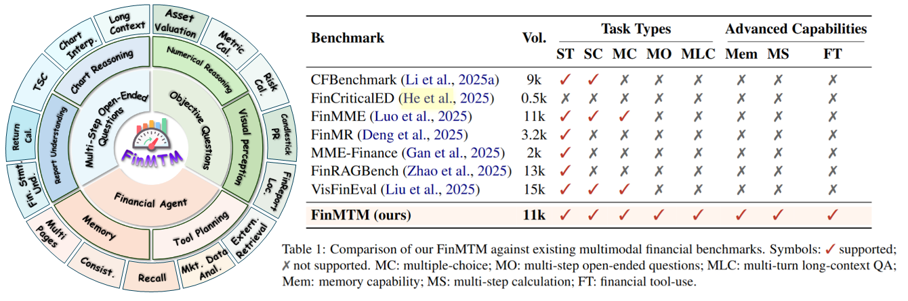

<p align="center">
  <h1 align="center">
    
    FinMTM: A Multi-Turn Multimodal Benchmark for Financial Reasoning and Agent Evaluation
  </h1>
</p>

<p align="center">
  📖<a href="https://arxiv.org/abs/2602.03130">[Paper]</a> | 🏠<a href="https://bbdjj.github.io/FinMTM.github-io/">[Project Page]</a>|🤗<a href="https://huggingface.co/datasets/HiThink-Research/FinMTM">[Huggingface]</a>
</p>
<br>
<p align="center">
  
</p>
<p align="center"><i>Overview of FinMTM: task types and capability coverage.</i></p>

---

## Table of Contents

- [🔥 Updates](#-updates)
- [🧭 Overview](#-overview)
- [📊 Benchmark Results](#-benchmark-results)
- [🔄 Evaluation Pipeline](#-evaluation-pipeline)
- [🛠️ Inference](#️-inference)
  - [Environment Setup](#environment-setup)
  - [Launching the Model Server](#launching-the-model-server)
  - [MTQA: Multi-Turn Visual QA](#mtqa-multi-turn-visual-qa)
  - [SC_MC: Single-Choice &amp; Multi-Choice QA](#sc_mc-single-choice--multi-choice-qa)
- [⚖️ Judge](#️-judge)
  - [MTQA Judge](#mtqa-judge)
  - [Agent Judge](#agent-judge)
- [📚 Agent Knowledge Base](#-agent-knowledge-base)
- [📄 License](#-license)
- [📚 Citation](#-citation)

---

## 🔥 Updates

- **2026-01**: Initial release of benchmark dataset and paper.
- **TBD**: Online leaderboard opens for submissions.

---

## 🧭 Overview

Financial reasoning is challenging for VLMs due to specialized chart formats, dense domain knowledge, long-horizon dependencies, and evidence-grounded tool use. Existing benchmarks are mostly single-turn and do not sufficiently measure **multi-turn dialogue stability**, **session-level memory**, or **agentic planning and execution**.

**FinMTM** addresses this gap with three task tracks:

| Task                            | Description                                                                                                     |
| ------------------------------- | --------------------------------------------------------------------------------------------------------------- |
| **Objective Questions**   | Single-choice and multiple-choice questions grounded in financial visuals                                       |
| **Open-Ended Questions**  | Multi-turn conversations stressing compositional reasoning, multi-step calculation, self-correction, and memory |
| **Financial Agent Tasks** | Tool-augmented multi-source workflows with long-horizon planning and evidence-grounded answers                  |

---

## 📊 Benchmark Results

We benchmark 22 leading VLMs on FinMTM. Final score = average of Objective, Open-Ended, and Agent tasks.

<details>
  <summary> Full Benchmark Results (Click to Expand)</summary>

**Column Definitions**

- **Objective:** Obj-Single (single-choice), Obj-Multi (multiple-choice)
- **Open-Ended:** Open-Com. (comprehension), Open-Cal. (calculation), Open-SelfCorr. (self-correction), Open-Mem. (memory)
- **Agent:** Agent-w fuzz / Agent-w/o fuzz

| Method                      |          Obj-Single |           Obj-Multi |           Open-Com. |           Open-Cal. |      Open-SelfCorr. |           Open-Mem. |        Agent-w fuzz |      Agent-w/o fuzz |
| --------------------------- | ------------------: | ------------------: | ------------------: | ------------------: | ------------------: | ------------------: | ------------------: | ------------------: |
| _Proprietary Models_      |                     |                     |                     |                     |                     |                     |                     |                     |
| ChatGPT-4o                  |                79.3 |                49.1 |                77.2 |                76.8 |                46.2 |                38.9 |                29.7 |                34.8 |
| ChatGPT-o3*                 |                85.8 |                73.3 |                83.8 |                78.6 |                52.8 |                43.6 |                31.4 |                35.2 |
| ChatGPT-5*                  |                89.0 |      **79.6** | `<u>`86.9`</u>` | `<u>`80.7`</u>` | `<u>`56.9`</u>` | `<u>`46.7`</u>` |                35.9 |                49.7 |
| Gemini 3 Flash              | `<u>`91.9`</u>` |                78.1 |                82.2 |                76.0 |                55.4 |                41.6 |      **53.6** |      **62.6** |
| Grok-4-fast-non-reasoning*  |                71.0 |                46.8 |                66.0 |                61.2 |                39.9 |                24.8 |                30.2 |                39.7 |
| Gemini 3 Pro                |      **92.1** | `<u>`78.4`</u>` |      **87.5** |      **82.8** |      **58.8** |      **48.5** | `<u>`48.3`</u>` | `<u>`54.3`</u>` |
| _InternVL Series_         |                     |                     |                     |                     |                     |                     |                     |                     |
| InternVL2.5-8B              |                63.8 |                25.7 |                55.1 |                49.2 |                26.5 |                16.7 |                 8.4 |                10.5 |
| InternVL2.5-26B             |                70.5 |                31.3 |                61.7 |                57.7 |                32.3 |                22.8 |                11.2 |                14.0 |
| InternVL2.5-40B             |                72.3 |                35.2 |                66.1 |                64.6 |                36.2 |                26.7 |                13.5 |                16.8 |
| InternVL3-78B               |                75.6 |                42.4 |                76.2 |                77.6 |                43.6 |                32.6 |                18.2 |                22.8 |
| _Other VLMs_              |                     |                     |                     |                     |                     |                     |                     |                     |
| MiMo-VL-7B                  |                61.1 |                21.4 |                75.1 |                75.4 |                47.2 |                39.9 |                20.2 |                25.5 |
| GLM4.5V-108B                |                73.7 |                51.0 |                85.4 |                79.6 |                51.1 |                42.2 |                26.5 |                32.4 |
| _Qwen VL Series_          |                     |                     |                     |                     |                     |                     |                     |                     |
| Qwen2.5-VL-3B               |                64.5 |                16.4 |                68.2 |                67.7 |                40.5 |                27.6 |                 9.4 |                11.9 |
| Qwen2.5-VL-7B               |                73.4 |                24.1 |                74.3 |                73.4 |                43.1 |                33.9 |                11.1 |                14.2 |
| Qwen3-VL-4B-Instruct        |                73.3 |                34.2 |                74.5 |                71.2 |                39.5 |                25.9 |                15.1 |                19.1 |
| Qwen3-VL-4B-Thinking        |                66.1 |                24.3 |                71.2 |                68.5 |                42.5 |                31.0 |                12.8 |                15.6 |
| Qwen3-VL-30B-A3B-Instruct   |                77.2 |                47.3 |                82.1 |                76.5 |                42.5 |                33.7 |                16.2 |                20.8 |
| Qwen3-VL-30B-A3B-Thinking   |                71.5 |                49.4 |                80.7 |                67.1 |                44.2 |                35.1 |                18.9 |                23.3 |
| Qwen3-VL-32B-Instruct       |                84.5 |                39.9 |                84.3 |                80.7 |                50.8 |                40.3 |                19.6 |                25.1 |
| Qwen3-VL-32B-Thinking       |                83.4 |                46.5 |                80.3 |                68.6 |                43.5 |                33.7 |                23.2 |                28.6 |
| Qwen3-VL-235B-A22B-Instruct |                81.3 |                48.5 |                85.5 |                80.9 |                54.5 |                41.5 |                32.1 |                38.7 |
| Qwen3-VL-235B-A22B-Thinking |                80.5 |                42.3 |                84.5 |                79.4 |                52.5 |                43.0 |                35.2 |                41.5 |

</details>

**Key Observations**

- Agentic settings expose larger gaps than reasoning-only settings.
- Removing identifiable entities increases difficulty and stresses evidence-grounded reasoning.
- Scaling helps, but robust tool planning and execution remain a major bottleneck for open-source models.

---

## 🔄 Evaluation Pipeline

FinMTM uses a two-stage evaluation pipeline: **Inference** → **Judge**. Each task track has its own dedicated inference and judge modules.

```
┌─────────────────────────────────────────────────────────────┐
│                    Stage 1: Inference                       │
│  ┌──────────────┐  ┌──────────────┐  ┌──────────────┐       │
│  │              │  │              │  │  Agent       │       │
│  │  Multi-turn  │  │  Single/Multi│  │  Tool-use    │       │
│  │  Visual QA   │  │  Choice QA   │  │  Agent       │       │
│  └──────────────┘  └──────────────┘  └──────────────┘       │
│         ↓                 ↓                  ↓              │
│  *_vlm.jsonl       *_result.jsonl     *_trace.jsonl         │
└─────────────────────────────────────────────────────────────┘
                        ↓
┌─────────────────────────────────────────────────────────────┐
│                    Stage 2: Judge                           │
│  ┌──────────────────────────┐  ┌────────────────────────┐   │
│  │  MTQA Judge              │  │  Agent Judge           │   │
│  │  Turn-level (1-10)       │  │  Answer / Tool /       │   │
│  │  Session-level (0-100)   │  │  Reasoning (0-100)     │   │
│  │  Multi-dimension scoring │  │  Tool F1 + EMR         │   │
│  └──────────────────────────┘  └────────────────────────┘   │
│         ↓                              ↓                    │
│  *_score.jsonl              *_score.jsonl                   │
└─────────────────────────────────────────────────────────────┘
```

### Evaluation Overview by Task

| Task                | Inference Module                | Judge Module               | Scoring                                                      |
| ------------------- | ------------------------------- | -------------------------- | ------------------------------------------------------------ |
| Multi-Turn QA       | `inference/MTQA/inference.py` | `judge/MTQA/`            | Turn-level (1-10) + Session-level (0-100) weighted composite |
| Single/Multi Choice | `inference/SC_MC/etest.py`    | — (built-in)              | Exact-match accuracy                                         |
| Financial Agent     | `judge/Agent/` (Stage 1)      | `judge/Agent/` (Stage 2) | Answer (0/50) + Tool F1 (0-25) + Reasoning (0-25)            |

---

## 🛠️ Inference

### Environment Setup

```bash
conda create -n finmtm python=3.10 -y
conda activate finmtm
pip install -r requirements.txt
```

Core dependencies:

```
torch >= 2.0.1
transformers
openai == 1.3.5
tqdm
```

Hardware: single GPU ≥ 24GB VRAM (H100 80GB / A100 80GB / 4090 24GB, etc.)

---

### Launching the Model Server

#### vLLM (Recommended for local open-source models)

```bash
pip install vllm

python -m vllm.entrypoints.openai.api_server \
  --model /path/to/your/model \
  --trust-remote-code \
  --served-model-name Your-Model-Name \
  --host 0.0.0.0 \
  --port 8000 \
  --tensor-parallel-size 1 \
  --max-model-len 30720
```

| Parameter                  | Description                                    |
| -------------------------- | ---------------------------------------------- |
| `--model`                | Model path (local directory or HuggingFace ID) |
| `--served-model-name`    | Model name referenced in the API               |
| `--tensor-parallel-size` | Number of GPUs; increase for multi-GPU setups  |
| `--max-model-len`        | Max context length; adjust based on VRAM       |
| `--port`                 | Server port (default 8000)                     |

**Verify the server is running:**

```bash
curl http://127.0.0.1:8000/v1/models
```

#### OpenAI API (GPT models)

```bash
export OPENAI_API_KEY=your_api_key_here
```

---

### MTQA: Multi-Turn Visual QA

Multi-turn conversational inference with session-level memory.

#### Data Format

Input: `.jsonl`, one sample per line.

```jsonl
{"image_path": "/path/to/image.jpg", "turns": [{"turn_id": "T1", "question": "...", "gold_answer": "..."}]}
{"image_paths": ["/path/to/img1.jpg", "/path/to/img2.png"], "turns": [...]}
```

| Field                   | Required | Description                          |
| ----------------------- | -------- | ------------------------------------ |
| `turns`               | ✅       | Array of conversation turns          |
| `turns[].question`    | ✅       | Question for this turn               |
| `turns[].turn_id`     | ❌       | Turn ID (e.g., T1, T2)               |
| `turns[].gold_answer` | ❌       | Ground truth (not used in inference) |
| `image_path`          | ✅       | Single image path (string)           |
| `image_paths`         | ✅       | Multiple image paths (list)          |

#### Running Inference

```bash
cd inference/MTQA
mkdir -p inputs outputs

# Place your data
cp /path/to/your/data.jsonl inputs/

# Run
OPENAI_API_KEY=EMPTY python3 inference.py \
  --backend openai \
  --api-base http://127.0.0.1:8000/v1 \
  --model Your-Model-Name \
  --input-dir ./inputs \
  --output-dir ./outputs \
  --include "*.jsonl"
```

#### Output Format

```jsonl
{
  "image_path": "/path/to/image.jpg",
  "turns": [
    {
      "turn_id": "T1",
      "question": "...",
      "gold_answer": "...",
      "model_answer": "The model's response to this turn."
    }
  ]
}
```

Output is written to `{original_name}_vlm.jsonl` in `--output-dir`.

#### MTQA Parameters

| Parameter         | Default                      | Description                       |
| ----------------- | ---------------------------- | --------------------------------- |
| `--backend`     | `qwen3vl`                  | Backend:`openai` or `qwen3vl` |
| `--api-base`    | `http://localhost:8000/v1` | API server address                |
| `--model`       | `qwen3vl`                  | Model name                        |
| `--input-dir`   | (required)                   | Input `.jsonl` directory        |
| `--output-dir`  | (required)                   | Output directory                  |
| `--include`     | `*.jsonl`                  | Glob pattern for input files      |
| `--max-retries` | `2`                        | Max retries per turn on failure   |
| `--retry-sleep` | `1.5`                      | Seconds between retries           |

---

### SC_MC: Single-Choice & Multi-Choice QA

Single-round multiple-choice question inference with accuracy evaluation.

#### Data Format

Input: `.jsonl`, one sample per line.

```jsonl
{
  "messages": [
    {
      "content": [
        {"type": "text", "text": "Which company had the highest revenue in 2023?\nA. Company A\nB. Company B\nC. Company C\nD. Company D"},
        {"type": "image_url", "image_url": {"url": "/path/to/image.jpg"}}
      ]
    }
  ],
  "choices": [
    {"message": {"content": [{"text": "{\"answer\": \"A\"}"}]}}
  ]
}
```

| Field                                  | Required | Description                                                           |
| -------------------------------------- | -------- | --------------------------------------------------------------------- |
| `messages[0].content`                | ✅       | Array of text + image parts                                           |
| `messages[0].content[].text`         | ✅       | Question text with options                                            |
| `messages[0].content[].image_url`    | ❌       | Image attachment                                                      |
| `choices[0].message.content[0].text` | ✅       | Ground truth in JSON:`{"answer": "A"}` or `{"answer": ["A","C"]}` |

#### Running Inference

```bash
cd inference/SC_MC
mkdir -p inputs outputs

# Place your data
cp /path/to/your/data.jsonl inputs/

# Run
OPENAI_API_KEY=EMPTY python3 etest.py \
  --input inputs/your_data.jsonl \
  --output outputs/eval_results.jsonl \
  --summary outputs/eval_summary.json \
  --api-base http://127.0.0.1:8000/v1 \
  --model Your-Model-Name
```

#### Answer Parsing

The parser accepts three formats automatically:

| Format          | Example                                          | Returns                       |
| --------------- | ------------------------------------------------ | ----------------------------- |
| JSON object     | `{"answer": "A"}` or `{"answer": ["A","C"]}` | `['A']` / `['A','C']`     |
| Comma-separated | `"A,C"`                                        | `['A', 'C']`                |
| Bare letter(s)  | `"A"` or `"ABC"`                             | `['A']` / `['A','B','C']` |

#### Output Files

After evaluation:

```
outputs/
├── eval_results.jsonl   # Per-sample results: gt, model answer, correct/incorrect
└── eval_summary.json    # Aggregate: total, correct, accuracy
```

`eval_summary.json` example:

```json
{
  "total": 1000,
  "correct": 782,
  "accuracy": 0.782
}
```

#### SC_MC Parameters

| Parameter         | Default                       | Description                    |
| ----------------- | ----------------------------- | ------------------------------ |
| `--input`       | (required)                    | Input `.jsonl` file          |
| `--output`      | `eval_results.jsonl`        | Per-sample result output path  |
| `--summary`     | `eval_summary.json`         | Summary statistics output path |
| `--api-base`    | `http://localhost:8000/v1`  | API server address             |
| `--model`       | `Qwen3-VL-30B-A3B-Instruct` | Model name                     |
| `--temperature` | `0.0`                       | Sampling temperature           |

---

## ⚖️ Judge

The Judge modules evaluate model outputs with task-specific metrics. Both MTQA and Agent have their own evaluation logic.

### MTQA Judge

Evaluates multi-turn dialogues at two levels: **turn-level** and **session-level**.

#### Pipeline Architecture

```
Input ( *_vlm.jsonl )
    │
    ├── Turn-Level Scoring ──► judge_financial_turn()
    │     Each turn rated 1-10 across 5 dimensions:
    │       • Visual Precision
    │       • Financial Logic
    │       • Data Accuracy
    │       • Cross-Modal Verification
    │       • Temporal Awareness
    │     → avg_turn_score (mean across turns)
    │
    └── Session-Level Scoring ──► session_judge.py
          Branch by session type:
            ├── L1 (5 turns)       → judge_session_behavior()
            ├── L2 (4 turns)       → judge_session_logic_reasoning()
            ├── Multi-view         → judge_session_multiview()
            └── Default            → judge_session_v2()
          → session_score (0-100)

Final = (avg_turn_score * weight) + (session_score * weight)
```

#### Running Evaluation

```bash
cd judge/MTQA

python -m main \
  --dirs /path/to/inference/outputs \
  --pattern "L*_with_id_vlm.jsonl" \
  --out_subdir scores \
  --client qwen \
  --api_base http://127.0.0.1:8000/v1 \
  --model Your-Model-Name
```

#### Input Format

The judge reads inference output files with the naming convention `L*_with_id_vlm.jsonl`. The level (L1–L4) is auto-detected from the filename.

```jsonl
{
  "image_path": "/path/to/image.jpg",
  "turns": [
    {
      "turn_id": "T1",
      "question": "Locate the lowest point of the green line...",
      "gold_answer": "Approximately -50.",
      "model_answer": "The lowest point is around -50."
    },
    ...
  ]
}
```

#### Output Format

```jsonl
{
  "final_composite_score": 85.2,
  "avg_turn_score": 8.1,
  "session_structure_score": 82.0,
  "is_pass": true,
  "session_critique": "...",
  "turn_details": [
    {
      "turn_id": "T1",
      "score": 8,
      "comment": "...",
      "details": {
        "Visual_Precision": 8,
        "Financial_Logic": 8,
        "Data_Accuracy": 7,
        "Cross_Modal_Verification": 8,
        "Temporal_Awareness": 9,
        "Overall_Score": 8
      }
    }
  ],
  "session_details": {
    "Score": 82,
    "Pass": true,
    "Deductions": []
  }
}
```

#### MTQA Judge Parameters

| Parameter        | Default                      | Description                                           |
| ---------------- | ---------------------------- | ----------------------------------------------------- |
| `--dirs`       | (required)                   | Directories containing `L*_with_id_vlm.jsonl` files |
| `--pattern`    | `L*_with_id_vlm.jsonl`     | Glob pattern for input files                          |
| `--out_subdir` | `scores`                   | Output subdirectory name                              |
| `--client`     | `qwen`                     | Judge client:`qwen` or `gemini`                   |
| `--api_base`   | `http://localhost:8000/v1` | API base for Qwen judge                               |
| `--model`      | (required for qwen)          | Model name for Qwen judge                             |

#### Scoring Weights

| Session Type    | Turn Weight | Session Weight |
| --------------- | ----------- | -------------- |
| Default (L3/L4) | 40%         | 60%            |
| L1 (5 turns)    | 50%         | 50%            |
| L2 (4 turns)    | 50%         | 50%            |

#### Key Configuration (`judge/MTQA/config.py`)

| Parameter              | Default | Description                                     |
| ---------------------- | ------- | ----------------------------------------------- |
| `CITATION_FAIL_TH`   | `6`   | Citation score threshold for multiview penalty  |
| `ROBUSTNESS_FAIL_TH` | `5`   | Robustness score threshold for behavior penalty |
| `PENALTY_MULT`       | `0.3` | Score multiplier when threshold is not met      |

---

### Agent Judge

The Agent pipeline runs in two stages: **Stage 1 (Inference)** generates multi-turn tool-use trajectories via MCP, and **Stage 2 (Judge)** scores the trajectories across Answer, Tool, and Reasoning dimensions.

#### Stage 1 — Agent Inference

Requires a running MCP server (e.g., at `http://localhost:8081/sse`) providing the following financial tools:

| Tool | Description |
|------|-------------|
| **FinQuery** | Financial data retrieval: market quotes, macro data, fundamentals, trading information |
| **StockNews** | Real-time stock news retrieval |
| **AnalysisLib** | Financial analysis toolkit generating structured analysis frameworks for stocks, indices, futures, and funds; also supports investment recommendations |
| **NoticeSearch** | Corporate announcement retrieval (e.g., filings, disclosures) |
| **VisitWeb** | Parses webpage content from a given URL and returns it in text format |

```bash
cd judge/Agent

# Stage 1 only: generate traces
python -m main \
  --mode inference \
  --input /path/to/agent_data.jsonl \
  --out_root /path/to/output \
  --models qwen3vl_30b_a3b
```

#### Stage 2 — Agent Evaluation

```bash
# Stage 2 only (requires existing trace file)
python -m main \
  --mode eval \
  --input /path/to/agent_data.jsonl \
  --out_root /path/to/output \
  --models qwen3vl_30b_a3b
```

#### Combined (Both Stages)

```bash
# Run inference then evaluation
python -m main \
  --mode all \
  --input /path/to/agent_data.jsonl \
  --out_root /path/to/output \
  --models qwen3vl_30b_a3b,gemini
```

#### Agent Data Format

```jsonl
{
  "image_path": "/path/to/image.png",
  "turn": {
    "question": "Which company is shown in the chart? Provide your reasoning and conclusion.",
    "gold_answer": {"final_conclusion": "..."}
  }
}
```

#### Scoring Breakdown (Total: 100)

| Dimension           | Max Score | Description                                                            |
| ------------------- | --------- | ---------------------------------------------------------------------- |
| **Answer**    | 0 or 50   | Exact match on key entities and numeric values                         |
| **Tool**      | 0–25     | Tool F1 based on predicted vs. reference tool calls                    |
| **Reasoning** | 0–25     | Assesses hallucination, logical coherence, and tool-result consistency |

Tool metrics computed:

- **Recall**: fraction of reference tools correctly predicted
- **Precision**: fraction of predicted tools that are correct
- **F1**: harmonic mean of recall and precision
- **EMR**: exact match rate (0/1 — full sequence match)

#### Agent Output Format

```jsonl
{
  "sample_id": 1,
  "question": "...",
  "scores": {
    "answer": 50,
    "tool": 18,
    "reasoning": 20,
    "total": 88
  },
  "metrics": {
    "tool_recall": 0.75,
    "tool_precision": 0.70,
    "tool_f1": 0.72,
    "tool_emr": 0
  },
  "basis": {
    "answer": "Entity and value match.",
    "tool": "Missing FinQuery, extra Search.",
    "reasoning": "Minor logical gap."
  }
}
```

#### Agent Judge Parameters

| Parameter      | Default    | Description                          |
| -------------- | ---------- | ------------------------------------ |
| `--mode`     | `all`    | `all` / `inference` / `eval`   |
| `--input`    | (required) | Input JSONL file                     |
| `--out_root` | (required) | Root output directory                |
| `--models`   | (all)      | Comma-separated model keys to run    |
| `--with_ts`  | false      | Append timestamp to output directory |

---

## 📚 Agent Knowledge Base (Data Synthesis)

FinMTM provides reference knowledge bases to support **financial long-chain Agent data synthesis**. These files serve as structured fact repositories for building multi-step tool-use reasoning trajectories.

| File | Role | Count | Content |
|------|------|------:|---------|
| `action_kb.jsonl` | Document-grounded tool-call trajectories | 66 | Chart → Company identification → 4-step tool planning + execution results |
| `knowledge_base2.jsonl` | Structured financial facts | 100 | Company → 8-dimension facts (market cap, PE, PB, PS, industry, financials, performance, news) + traceable evidence |

These resources can be used as SFT trajectory pairs or RAG-grounded fact libraries for training and evaluating financial Agent models.

---

## 📄 License

 

**Code:** Apache 2.0
**Dataset:** CC BY-NC 4.0

Research-use only. Must comply with: https://openai.com/policies/terms-of-use.

---

## 📚 Citation

If you find our work useful, please consider citing:

```bibtex

```
